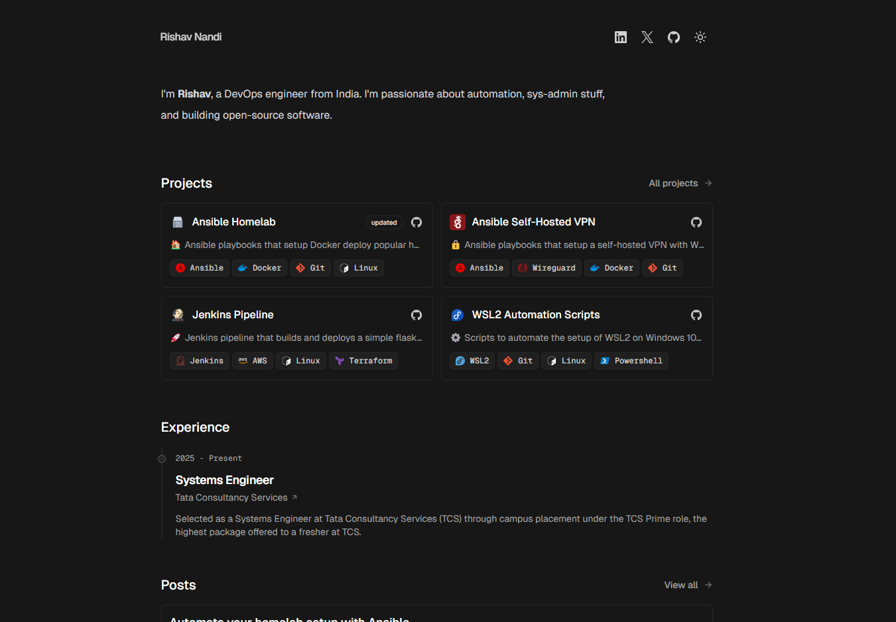

<div align="center">
<a href="https://rishavnandi.com">

</a>
<p></p>
</div>

<div align="center">
    <a href="https://rishavnandi.com" target="_blank">
        Website
    </a>
    <span>&nbsp;❖&nbsp;</span>
    <a href="https://github.com/rishavnandi/rishavnandi.com?tab=readme-ov-file#-stack">
        Stack
    </a>
    <span>&nbsp;❖&nbsp;</span>
    <a href="https://github.com/rishavnandi/rishavnandi.com?tab=readme-ov-file#-contributing">
        Contribute
    </a>
    <span>&nbsp;❖&nbsp;</span>
    <a href="https://rishavnandi.com/tw">
        X (formerly Twitter)
    </a>
</div>

</p>

<div align="center">


</div>


## 📦 Stack

- [**Sveltekit** + **Svelte 5**](https://svelte.dev/) - Web development for the rest of us.
- [**Typescript**](https://www.typescriptlang.org/) - JavaScript with syntax for types.
- [**mdsvex**](https://mdsvex.com/) - Markdown for Svelte apps.
- [**Shiki**](https://github.com/shikijs/shiki) - A beautiful Syntax Highlighter.
- [**Tailwindcss**](https://tailwindcss.com/) - A utility-first CSS framework for rapidly building custom designs.
- [**bits-ui**](https://www.bits-ui.com) - A collection of headless components for Svelte.
- [**clsx**](https://github.com/lukeed/clsx) + [**tailwind-variants**](https://www.tailwind-variants.org/) - The power of Tailwind combined with a first-class variant API.
- [**Prettier**](https://prettier.io/) + [prettier-plugin-tailwindcss](https://github.com/tailwindlabs/prettier-plugin-tailwindcss) - An opinionated code formatter.
- [**Lucide Icons**](https://lucide.dev/) + [**svgl**](https://svgl.app/) - Beautifully SVGs icons & logos.

## 🚀 Contributing

1. [Fork](https://github.com/rishavnandi/rishavnandi.com/fork) the repository.

2. Install dependencies:

```bash
# Install pnpm globally if you don't have it:
npm install -g pnpm

# and install dependencies:
pnpm install
```

3. Run the development server:

```bash
pnpm dev
```

Open up [http://localhost:5173](http://localhost:5173) and make your changes ✨.

## 📄 License

- [**WTFPL License**](https://github.com/rishavnandi/rishavnandi.com?tab=WTFPL-1-ov-file#readme).